# Application Monitor - Simple User Guide

This guide explains the main pages in the monitoring app in simple terms.

Use this app to answer four basic questions:

- Which tenants or apps have problems?
- Which app has more errors or slow responses?
- Which workflows failed?
- How can I check the reason for a workflow failure?

---

## 1. Dashboard Page

### What This Page Is

The **Dashboard** page is the main overview page.

It shows the health of all tenants and apps in one place. Start here when you want to quickly check if anything is failing.

### Screenshot: Dashboard Overview

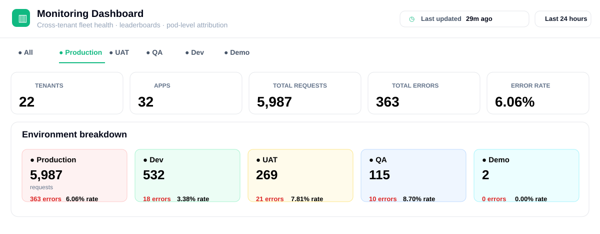

This is the top part of the Dashboard.

| Area | Meaning | How to Use |
| --- | --- | --- |
| Last updated | When the dashboard data was last refreshed. | If this is old, refresh or check the analyzer. |
| Date range | Time period used for all dashboard values. | Change this before comparing errors. |
| Environment tabs | Filters data by All, Production, UAT, QA, Dev, or Demo. | Select **Production** first for user-impact checks. |
| Tenants | Number of clients shown in the selected filter. | Use this to know how many clients are included. |
| Apps | Number of apps included. | More apps means wider impact. |
| Total requests | Total traffic in the selected time range. | Compare this with total errors. |
| Total errors | Total failed requests. | If high, check leaderboards and tenant cards. |
| Error rate | Percentage of requests that failed. | High percentage means failures are affecting more traffic. |
| Environment breakdown | Side-by-side view by environment. | Find whether the issue is only in Production, UAT, QA, etc. |

How to check this section:

1. Select the correct **Date range**.
2. Select the correct **Environment**.
3. Check **Total errors** and **Error rate**.
4. Check the **Environment breakdown** to see where the issue is happening.
5. If Production has high errors, continue to tenant cards and leaderboards.

### What You Can Check Here

| Field | Meaning | How to Check |
| --- | --- | --- |
| Tenants | Total number of tenants shown in the selected time range. | Check the top summary cards. |
| Apps | Total number of apps monitored for those tenants. | Check the top summary cards. |
| Total Requests | Total API and workflow requests received by the apps. | A high number means the app had more activity. |
| Total Errors | Total failed requests. | If this is high, check the error rate and leaderboards. |
| Error Rate | Percentage of requests that failed. | Higher error rate means more failures. |
| Environment | Shows data for Production, UAT, QA, Dev, Demo, or All. | Use the environment tabs at the top. |
| Last Updated | Shows when the dashboard data was last refreshed. | If it is old, refresh the page or check the data source. |
| Date Range | Time period used for the data. | Change it to Last 1 hour, Last 24 hours, Last 7 days, or Last 30 days. |

### Tenant Cards

Each tenant card shows:

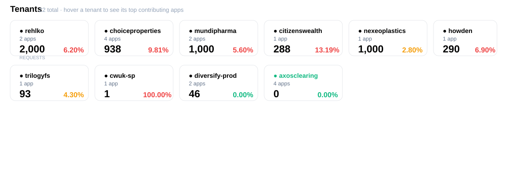

| Field | Meaning |
| --- | --- |
| Tenant Name | Name of the tenant. |
| App Count | Number of apps under that tenant. |
| Requests | Total requests for that tenant. |
| Error Rate | Percentage of failed requests. |
| Health Color | Green means good, yellow means warning, red means critical. |

How to check tenant cards:

1. Look for the highest **Error Rate**.
2. Check the **Requests** count next.
3. A high error rate with high requests means bigger impact.
4. Click the tenant card to open that tenant in **Tenant & Apps**.

### Screenshot: Tenant Hover Popover

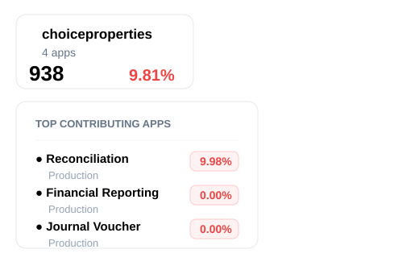

Hovering over a tenant shows the top apps contributing to that tenant's errors.

| Field | Meaning |
| --- | --- |
| App name | App inside the tenant. |
| Environment | Environment where that app is running. |
| Error rate | Failure percentage for that app. |

How to use it:

1. Hover over a tenant with a high error rate.
2. Find the app with the highest error rate.
3. Click the app row to open **Application Insights** directly.

### How to Use the Dashboard

1. Open **Dashboard**.
2. Select the required **Date Range**.
3. Select the required **Environment**.
4. Look at **Total Errors** and **Error Rate**.
5. Check the tenant cards and leaderboards.
6. Click a tenant or app to see more details.

### Leaderboards

The dashboard has leaderboards to show the worst-performing apps first.

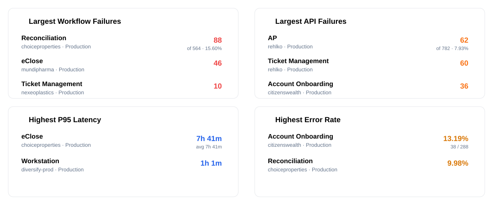

| Leaderboard | What It Shows |
| --- | --- |
| Largest Workflow Failures | Apps with the most failed workflows. |
| Largest API Failures | Apps with the most API errors. |
| Highest P95 Latency | Apps with slow responses. |
| Highest Error Rate | Apps with the highest failure percentage. |
| Top Failing Pods | Pods with the most errors. |
| Slowest Pods | Pods with high latency. |

Click any app row to open that app's details.

How to use leaderboards:

1. Use **Largest Workflow Failures** when workflows are failing.
2. Use **Largest API Failures** when API errors are high.
3. Use **Highest P95 Latency** when users report slowness.
4. Use **Highest Error Rate** when you want the worst failure percentage.
5. Click a row to open the app and investigate.

### Screenshot: Pod Leaderboards

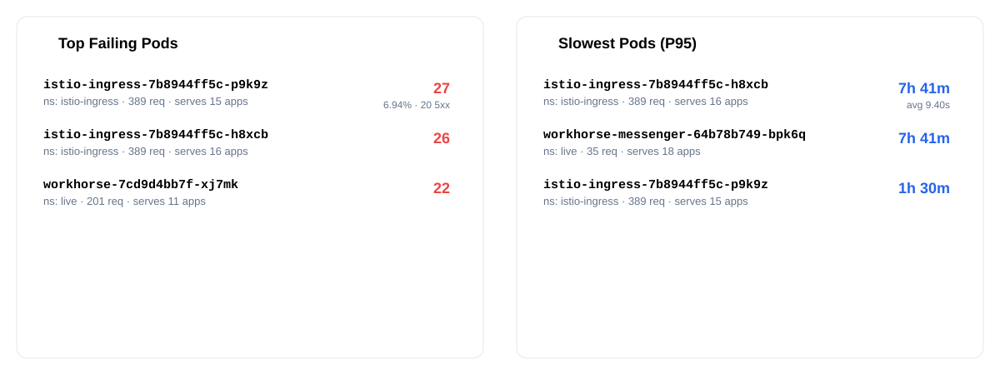

Pod leaderboards help you find infrastructure-level problems.

| Leaderboard | Meaning | How to Check |
| --- | --- | --- |
| Top Failing Pods | Pods with the most errors. | Check if many apps share the same failing pod. |
| Slowest Pods (P95) | Pods with the slowest response times. | Use this when latency is high. |
| Namespace | Kubernetes namespace where the pod runs. | Helps identify the service area. |
| Serves apps | Number of apps using the pod. | Higher number means wider impact. |
| 5xx count | Server-side failures from that pod. | High 5xx usually needs backend or platform investigation. |

How to use pod data:

1. Check whether the same pod appears in multiple rows.
2. Check how many apps the pod serves.
3. If many apps are affected, the issue may be shared infrastructure.
4. Click the pod row if the app supports drill-down.

### Screenshot: Critical Incident Summary

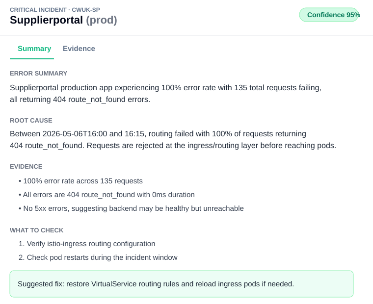

Some dashboard rows can open an incident-style analysis modal.

| Section | Meaning |
| --- | --- |
| Error summary | Short description of the issue. |
| Root cause | Why the app is likely failing. |
| Evidence | Facts used to support the analysis. |
| Impact | Business or user impact. |
| What to check | Actions to validate the issue. |
| Suggested fix | Recommended fix. |
| Confidence | How confident the analysis is. |

How to use it:

1. Read **Error summary** first.
2. Read **Root cause**.
3. Check **Evidence** to confirm the conclusion.
4. Follow **What to check** before applying the suggested fix.

### Screenshot: Critical Incident Evidence

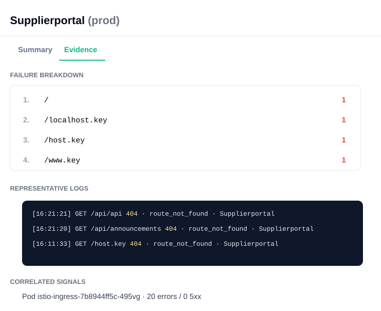

The **Evidence** tab shows the data behind the incident summary.

| Section | Meaning |
| --- | --- |
| Failure breakdown | Which paths or error patterns failed. |
| Representative logs | Example logs from the failure window. |
| Correlated signals | Related pods, apps, or error signals. |
| Root cause recap | Short repeat of the likely root cause. |

How to check evidence:

1. Look for repeated paths or repeated error codes.
2. Read representative logs.
3. Check correlated pods or services.
4. Use the evidence to confirm whether the suggested fix is correct.

---

## 2. Tenant And Apps Page

### What This Page Is

The **Tenant And Apps** page is used to drill down from a tenant to its apps.

Use this page when you know the tenant name and want to check which app is causing issues.

### Screenshot: Tenant List

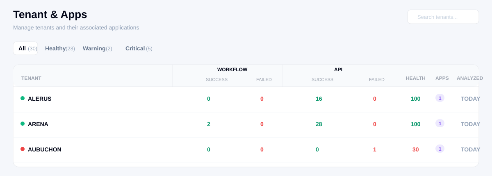

This page lists all tenants and shows their workflow, API, health, app count, and analyzed date.

| Area | Meaning | How to Use |
| --- | --- | --- |
| Page title | Shows that you are on **Tenant & Apps**. | Use this page to select a tenant. |
| Search tenants | Search box for tenant names. | Type a tenant name, such as `ALERUS`, to find it quickly. |
| All tab | Shows all tenants. | Use this when you want the full list. |
| Healthy tab | Shows tenants with good health. | Use this to check tenants without major issues. |
| Warning tab | Shows tenants with medium issues. | Use this when you want tenants that may need attention. |
| Critical tab | Shows tenants with serious issues. | Start here when investigating failures. |

### Tenant Table Fields

| Field | Meaning | How to Check |
| --- | --- | --- |
| Tenant | Tenant name. | Click the tenant row to open its apps. |
| Status dot | Health color for the tenant. | Green is healthy, yellow is warning, red is critical. |
| Workflow Success | Number of successful workflows. | Low value with high failed count means workflow issues. |
| Workflow Failed | Number of failed workflows. | If this is greater than 0, check the tenant apps. |
| API Success | Number of successful API calls. | Shows API activity that worked. |
| API Failed | Number of failed API calls. | If this is greater than 0, check app errors. |
| Health | Overall tenant health score. | Lower score means more problems. |
| Apps | Number of apps under the tenant. | Click the tenant to see these apps. |
| Analyzed | When the tenant was last analyzed. | If old, the data may not be current. |

In the screenshot:

| Tenant | What It Shows |
| --- | --- |
| ALERUS | Healthy. API success is 16, API failed is 0, health is 100. |
| ARENA | Healthy. Workflow success is 2, API success is 28, health is 100. |
| AUBUCHON | Critical. API failed is 1 and health is 30. |
| AVETA | Critical. API failed is 1 and health is 30. |
| CANOPIUS | Warning. Workflow failed is 1 and health is 77. |

How to check tenants:

1. Open **Tenant & Apps**.
2. Use **Critical** first to find tenants with serious issues.
3. Check **Workflow Failed** and **API Failed**.
4. Check **Health** score.
5. Click the tenant row to open its app list.
6. Open the app with errors and check **Application Insights**.

### Tenant List

| Field | Meaning | How to Check |
| --- | --- | --- |
| Tenant Name | Name of the tenant. | Use the search box to find it. |
| Workflow Success / Failed | Number of successful and failed workflows. | Check if failed count is high. |
| API Success / Failed | Number of successful and failed API calls. | Check if failed count is high. |
| Health | Overall score for the tenant. | Low score means the tenant needs attention. |
| Apps | Number of apps under the tenant. | Click the tenant to see the app list. |
| Analyzed | Last time the tenant data was analyzed. | If old, the data may not be current. |

### App List

After clicking a tenant, you will see the apps for that tenant.

### Screenshot: Applications In A Tenant

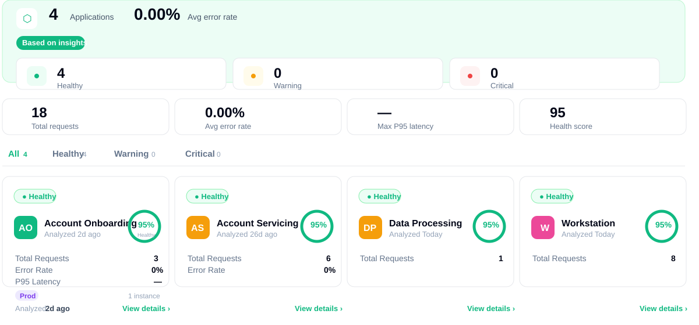

This page shows all applications inside the selected tenant.

### Tenant App Summary

| Field | Meaning | How to Check |
| --- | --- | --- |
| Applications | Number of apps under the selected tenant. | Use this to know how many apps are being monitored. |
| Avg error rate | Average error rate across all apps in this tenant. | If this is high, check the app cards below. |
| Healthy | Number of healthy apps. | Healthy apps usually do not need action. |
| Warning | Number of apps with medium issues. | Check these after critical apps. |
| Critical | Number of apps with serious issues. | Check these first. |
| Total requests | Total requests across all apps. | Shows total traffic for the tenant. |
| Max P95 latency | Highest P95 latency among apps. | If high, check which app is slow. |
| Health score | Overall tenant app health score. | Lower score means more problems. |

In the screenshot:

| Field | Value | Meaning |
| --- | --- | --- |
| Applications | 4 | The tenant has 4 apps. |
| Avg error rate | 0.00% | No average error issue is shown. |
| Healthy | 4 | All 4 apps are healthy. |
| Warning | 0 | No warning apps. |
| Critical | 0 | No critical apps. |
| Total requests | 18 | The apps received 18 requests. |
| Health score | 95 | Overall health is good. |

### App Filters

| Filter | Shows |
| --- | --- |
| All | All apps in the tenant. |
| Healthy | Only healthy apps. |
| Warning | Apps that need attention. |
| Critical | Apps with serious issues. |

Use **Critical** first when investigating problems.

### App Card Fields

| Field | Meaning |
| --- | --- |
| App Name | Name of the application. |
| Environment | Production, UAT, QA, Dev, Demo, etc. |
| Health | Health score for the app. |
| Requests | Number of requests for the selected time range. |
| Error Rate | Percentage of failed requests. |
| Latency Trend | Shows whether the app response time is increasing or decreasing. |
| Last Error | Last time an error was seen. |
| Analyzed | Last time this app data was analyzed. |
| Instance | Number of running app instances found. |
| View details | Opens Application Insights for this app. |

In the screenshot:

| App | What It Shows |
| --- | --- |
| Account Onboarding | Healthy, 3 requests, 0% error rate, Production environment. |
| Account Servicing | Healthy, 6 requests, 0% error rate, Production environment. |
| Data Processing | Healthy, 1 request, 0% error rate, Production environment. |
| Workstation | Healthy, 8 requests, 0% error rate, Production environment. |

How to check apps in a tenant:

1. Open **Tenant & Apps**.
2. Click the tenant.
3. Check the summary cards at the top.
4. Use **Critical** or **Warning** filters if there are issues.
5. On each app card, check **Total Requests**, **Error Rate**, **P95 Latency**, and **Health**.
6. Click **View details** to open **Application Insights**.

Click an app card to open **Application Insights**.

---

## 3. Application Insights Page

### What This Page Is

The **Application Insights** page shows details for one selected app.

Use this page to understand how one app is performing.

### Screenshot: Page Header And Summary

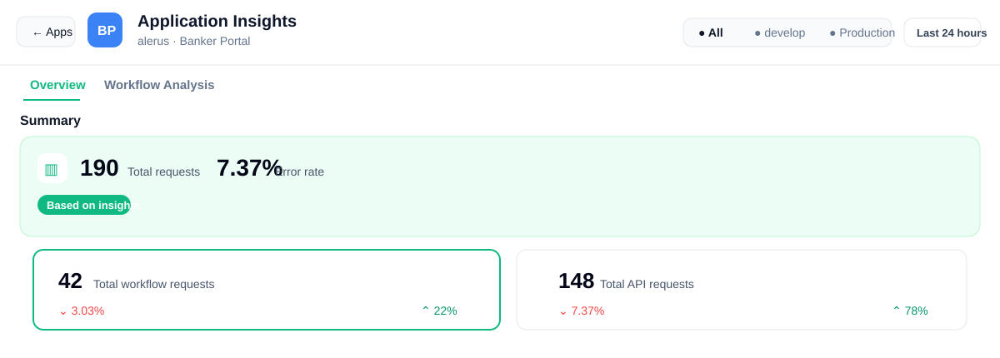

This is the top part of the Application Insights page.

| Area | What It Means | How to Use It |
| --- | --- | --- |
| Apps button | Goes back to the app list for the selected tenant. | Click this if you want to select another app. |
| App initials | Short name or initials of the app. | Use this to confirm you are checking the correct app. |
| App name | Current app name. In the screenshot, it is **Banker Portal**. | Always confirm this before checking errors. |
| Tenant name | Tenant that owns the app. In the screenshot, it is **alerus**. | Use this to confirm you are in the correct tenant. |
| Environment filter | Shows **All**, **develop**, **Production**, **UAT**, etc. | Select one environment if you want to check only that environment. |
| Date range | Time period used for all numbers and charts. | Change this before investigating if you need a different time period. |
| Overview tab | Shows health, requests, errors, API failures, environment split, and charts. | Use this first. |
| Workflow Analysis tab | Shows workflow runs and failures. | Open this when workflow failures need investigation. |

In the screenshot:

| Field | Value | Meaning |
| --- | --- | --- |
| Total requests | 190 | The app received 190 requests in the selected time range. |
| Error rate | 7.37% | 7.37% of requests failed. |
| Total workflow requests | 42 | 42 requests were workflow-related. |
| Total API requests | 148 | 148 requests were API-related. |

How to check this section:

1. Confirm the tenant and app name.
2. Select the correct environment.
3. Select the correct date range.
4. Check **Total requests** to understand traffic.
5. Check **Error rate** to understand whether failures are high.
6. If error rate is high, scroll down to **API Failures**, **Environment Breakdown**, and the **Errors** chart.

### Filters On This Page

| Filter | Meaning | How to Use |
| --- | --- | --- |
| Environment | Shows data for one environment or all environments. | Select Production, UAT, QA, Dev, Demo, or All. |
| Date Range | Time period for the app data. | Change it if you want to check recent or older activity. |
| Overview Tab | Shows request, error, health, and latency details. | Use this first for general app health. |
| Workflow Analysis Tab | Shows workflow executions and failures. | Use this when workflow failures are present. |

### Overview Tab Fields

| Field | Meaning | How to Check |
| --- | --- | --- |
| Total Requests | Total number of requests handled by the app. | Compare this with errors to understand impact. |
| Workflow Requests | Requests related to workflows. | Useful when checking workflow-heavy apps. |
| API Requests | Requests related to APIs. | Useful when checking API failures. |
| Total Errors | Total number of failed requests. | If high, check error rate and workflow failures. |
| Error Rate | Percentage of failed requests. | Higher value means more failures. |
| Health Score | Overall app health score. | Low score means the app needs attention. |
| Average Latency | Average response time. | High latency means the app is slow. |
| P95 Latency | Response time for the slowest 5% of requests. | High P95 means some users may see slow responses. |

### Screenshot: API Failures And Environment Breakdown

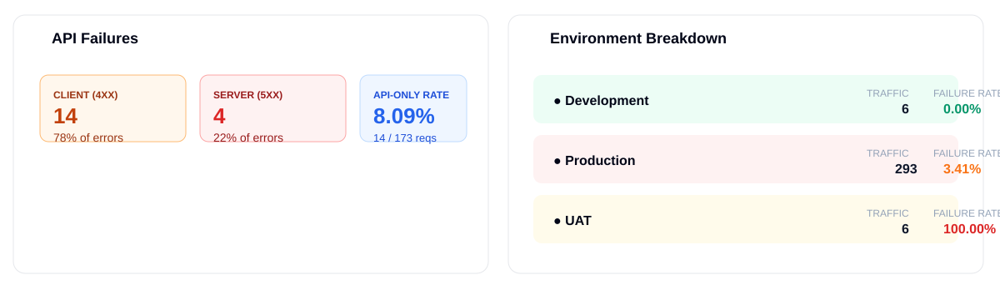

This section helps you understand where failures are coming from.

#### API Failures

| Field | Meaning | How to Check |
| --- | --- | --- |
| Client (4xx) | Errors caused by client-side problems, such as bad request, unauthorized, forbidden, or not found. | If this is high, check request input, permissions, URLs, or missing records. |
| Server (5xx) | Errors caused by backend/server problems. | If this is high, check service logs and failed workflows. |
| API-only rate | Error rate for API requests only. | Use this to check whether API calls are failing even if workflows are normal. |

In the screenshot:

| Field | Value | Meaning |
| --- | --- | --- |
| Client (4xx) | 14 | Most API failures are client-side errors. |
| Server (5xx) | 4 | Some backend/server errors are also present. |
| API-only rate | 8.09% | 14 out of 173 API requests failed. |

How to check API errors:

1. Start with **Client (4xx)** and **Server (5xx)**.
2. If **4xx** is high, check whether users are sending wrong input or accessing missing data.
3. If **5xx** is high, check backend service logs and workflow failures.
4. Check the **Errors** chart to see when these failures happened.

#### Environment Breakdown

| Field | Meaning | How to Check |
| --- | --- | --- |
| Environment name | Environment where the app is running. | Compare Production, UAT, develop, etc. |
| Analyzed | Last time data was analyzed for that environment. | If this is old, the data may not be fresh. |
| Traffic | Number of requests in that environment. | Higher traffic means higher user impact. |
| P95 | Slow response time for that environment. | High value means slowness in that environment. |
| Failure rate | Percentage of failed requests in that environment. | High value means that environment has issues. |

In the screenshot:

| Environment | What It Shows |
| --- | --- |
| Development | Low traffic and 0.00% failure rate. |
| Production | High traffic and 3.41% failure rate. This has more user impact. |
| UAT | Low traffic but 100.00% failure rate. This means all UAT requests failed in the selected time range. |

How to check environment issues:

1. Look for the highest **Failure rate**.
2. Check whether that environment also has high **Traffic**.
3. If **Production** has failures, investigate first because users may be affected.
4. Select that environment in the top filter to see only its data.

### Charts

The charts help you see changes over time.

| Chart | What It Helps You Find |
| --- | --- |
| Requests | When traffic increased or dropped. |
| Errors | When failures started increasing. |
| Latency | When the app became slow. |
| Error Rate | Whether failures are a small or large part of traffic. |

Use the chart/list toggle if you want to see values in table format.

### Screenshot: Chart View

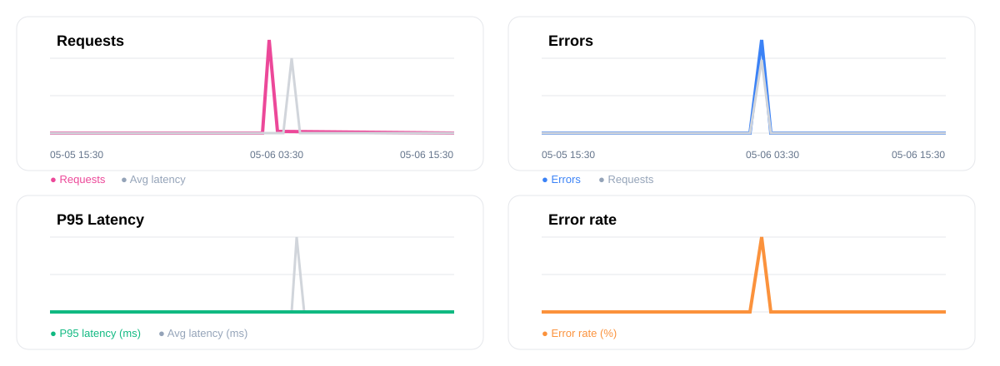

The chart view shows values over time. Use it to find when a problem started.

| Chart | Line Color | What To Look For |
| --- | --- | --- |
| Requests | Pink | Traffic spikes or drops. |
| Errors | Blue | Error spikes. |
| P95 Latency | Green | Slow response spikes. |
| Error rate | Orange | High failure percentage. |
| Grey line | Grey | Related comparison line, such as average latency or request volume. |

How to check errors from chart view:

1. Find the highest spike in the **Errors** chart.
2. Check the time under that spike on the X axis.
3. Check the **Requests** chart at the same time.
4. Check the **Error rate** chart at the same time.
5. If the error spike matches workflow failures, open **Workflow Analysis**.

### Screenshot: List View

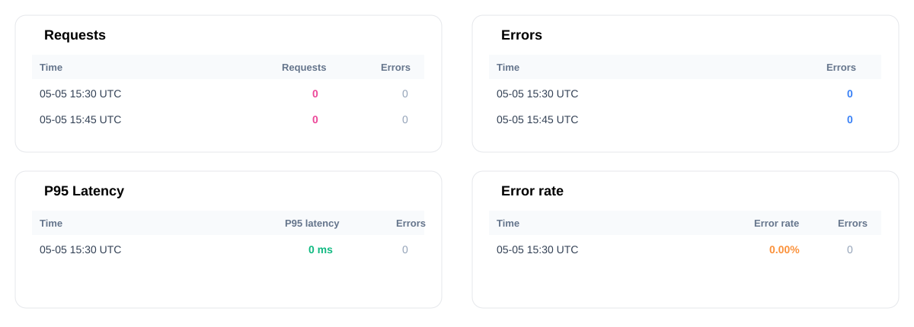

The list view shows the same chart data in rows.

Use list view when you need exact values.

| Column | Meaning |
| --- | --- |
| Time | Time bucket for that row. |
| Requests | Number of requests during that time. |
| Errors | Number of errors during that time. |
| P95 latency | Slow response time during that time. |
| Error rate | Failure percentage during that time. |

How to check errors from list view:

1. Click the **List** icon on the chart.
2. Find the row where **Errors** is more than 0.
3. Note the **Time** value.
4. Check the **Error rate** for the same row.
5. Open **Workflow Analysis** and search for failed workflows around that time.

### How To Read Charts

All charts are read in the same basic way:

| Chart Part | Meaning |
| --- | --- |
| X axis | Time. Read from left to right to see when something happened. |
| Y axis | The value being measured, such as requests, errors, latency, or error rate. |
| Line going up | The value increased at that time. |
| Line going down | The value decreased at that time. |
| Spike | A sudden increase. Spikes are usually the first place to check. |
| Chart button | Shows the graph view. |
| List button | Shows the same data in table format. Use this when you want exact values. |

To check errors from any chart:

1. Find the time where the line spikes.
2. Hover on that point to see the time and value.
3. If the chart or list shows an **Errors** value, click that time row or point to open the error details.
4. If error details are not enough, open **Workflow Analysis** and check failed workflows around the same time.

### Requests Chart

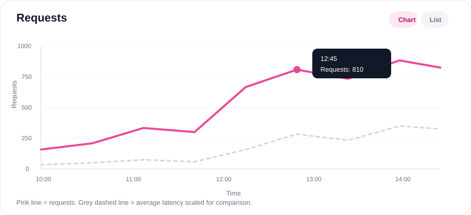

The **Requests** chart shows how much traffic the app received.

| Axis | Meaning |
| --- | --- |
| X axis | Time. |
| Y axis | Number of requests. |

How to check:

1. Look for a sudden increase in requests.
2. Check whether errors also increased at the same time.
3. If requests are high but errors are low, the app is handling traffic normally.
4. If requests and errors both increase, open the **Errors** chart and check the same time.

### Errors Chart

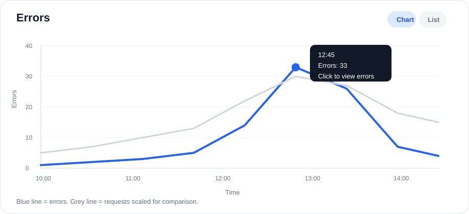

The **Errors** chart shows how many requests failed.

| Axis | Meaning |
| --- | --- |
| X axis | Time. |
| Y axis | Number of errors. |

How to check:

1. Look for the highest error spike.
2. Hover on the spike to see the time and error count.
3. Click the spike or switch to **List** view and click that time row to see error samples.
4. Note the time, then check **Workflow Analysis** for failed workflows around that same time.

### P95 Latency Chart

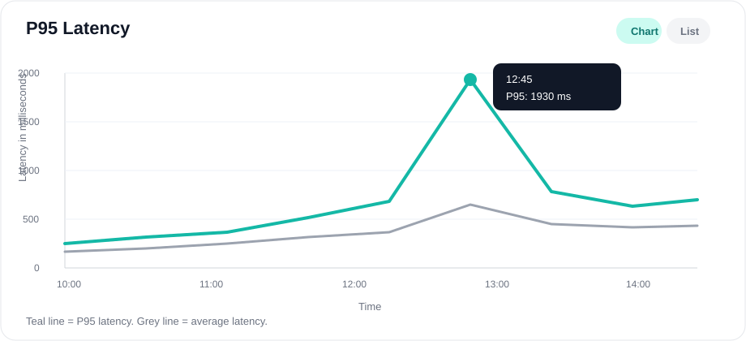

The **P95 Latency** chart shows slow response time for the slowest group of users.

P95 means 95% of requests were faster than this value, and 5% were slower.

| Axis | Meaning |
| --- | --- |
| X axis | Time. |
| Y axis | Response time in milliseconds. |

How to check:

1. Look for a latency spike.
2. Hover on the spike to see the time and latency value.
3. Check whether errors increased at the same time.
4. If latency is high but errors are low, users may see slowness but requests may still be completing.
5. If latency and errors both increase, investigate the app and failed workflows for that time.

### Error Rate Chart

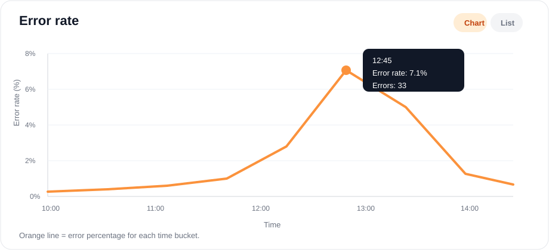

The **Error Rate** chart shows what percentage of requests failed.

This is often more useful than total errors because it compares errors with traffic.

| Axis | Meaning |
| --- | --- |
| X axis | Time. |
| Y axis | Error percentage. |

How to check:

1. Look for the highest percentage spike.
2. Hover on the spike to see the error rate.
3. Switch to **List** view if you need the exact percentage.
4. Check the **Errors** chart for the same time.
5. Open **Workflow Analysis** if the error rate spike matches workflow failures.

### Simple Chart Example

If the **Errors** chart spikes at 12:45:

1. Check the **Requests** chart at 12:45.
2. If requests also spiked, the errors may be traffic-related.
3. Check the **Error Rate** chart at 12:45.
4. If error rate is also high, the app has a real failure issue.
5. Open **Workflow Analysis**, filter by **Failed**, and check workflows started around 12:45.

### How to Check App Health

1. Open the app from Dashboard or Tenant And Apps.
2. Select the correct **Environment**.
3. Select the correct **Date Range**.
4. Check **Health Score**, **Total Errors**, and **Error Rate**.
5. Check **P95 Latency** if users reported slowness.
6. Open **Workflow Analysis** if workflow failures are shown.

---

## 4. Workflow Analysis Page

### What This Page Is

The **Workflow Analysis** page shows workflow executions for the selected app.

Use this page when you want to find failed, running, or completed workflows.

### Screenshot: Workflow Summary Cards

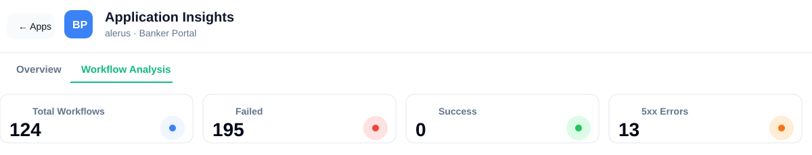

This is the top part of the Workflow Analysis tab.

| Field | Meaning | How to Check |
| --- | --- | --- |
| Total Workflows | Total workflow runs found for the selected app and date range. | Use this to understand total workflow activity. |
| Failed | Number of failed workflow runs. | If this is high, check the failed workflow table. |
| Success | Number of successful workflow runs. | If this is low or zero, workflows may be failing often. |
| 5xx Errors | Failed workflows with server-side errors. | These usually need deeper investigation. |

In the screenshot:

| Field | Value | Meaning |
| --- | --- | --- |
| Total Workflows | 124 | 124 workflow runs are shown for the selected range. |
| Failed | 195 | Many workflow failures were detected. |
| Success | 0 | No successful workflows are shown in this view. |
| 5xx Errors | 13 | 13 workflow failures are linked to server-side errors. |

How to check this section:

1. Confirm you are on **Workflow Analysis**.
2. Check **Failed** first.
3. Check **5xx Errors** next because these are usually backend failures.
4. If failures are high, scroll to the workflow table and click **Investigate**.

### Screenshot: Failed Workflow Table

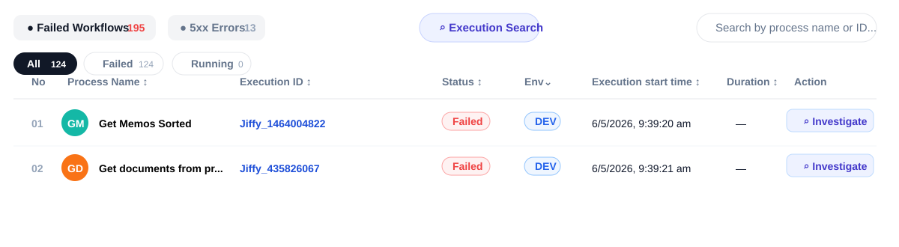

This table lists workflow executions.

| Area | Meaning | How to Use |
| --- | --- | --- |
| Failed Workflows tab | Shows failed workflows. | Click this when you want all workflow failures. |
| 5xx Errors tab | Shows failed workflows caused by server errors. | Click this when you want backend-related failures. |
| Execution Search | Opens or focuses execution search. | Use it when you have an execution or workflow ID. |
| Search box | Searches by process name or ID. | Type a process name or workflow ID. |
| Status filters | All, Failed, Running, Completed. | Use these to narrow the table. |

Workflow table fields:

| Field | Meaning | How to Check |
| --- | --- | --- |
| No | Row number. | Used only for reading the table. |
| Process Name | Workflow process name. | Use this to identify which workflow failed. |
| Execution ID | Unique workflow or execution ID. | Copy this ID when reporting the issue. |
| Status | Workflow status. | Failed workflows need investigation. |
| Env | Environment where the workflow ran. | Check if the issue is in DEV, Production, UAT, etc. |
| Execution start time | Time when the workflow started. | Use this to match the failure with logs or charts. |
| Duration | How long the workflow ran. | A dash means duration is not available. |
| Action | Investigate button. | Click it to open failure details. |

How to check a failed workflow:

1. Click the **Failed** filter.
2. Search by process name or workflow ID if needed.
3. Check the **Execution start time**.
4. Check the **Env** value.
5. Click **Investigate** for the workflow you want to inspect.

### Screenshot: 5xx Workflow Table

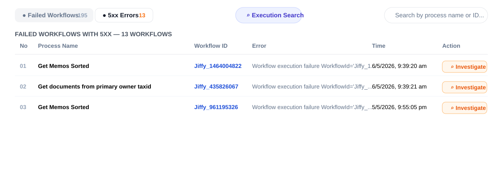

The **5xx Errors** view shows failed workflows that had server-side failures.

Use this when the app has backend errors or the API Failures section shows 5xx errors.

| Field | Meaning | How to Check |
| --- | --- | --- |
| Process Name | Workflow process that failed. | Look for repeated process names. |
| Workflow ID | Unique ID of the failed workflow. | Copy this when reporting the issue. |
| Error | Short error message. | Read this for the first clue. |
| Time | Failure or execution time. | Match this with charts and logs. |
| Investigate | Opens detailed investigation. | Click this for root cause and logs. |

How to check 5xx failures:

1. Click **5xx Errors**.
2. Look for repeated process names.
3. Look for repeated error messages.
4. Click **Investigate** on the most recent or most repeated failure.
5. Check the root cause, failure chain, and evidence logs.

### Screenshot: Top Failing Errors

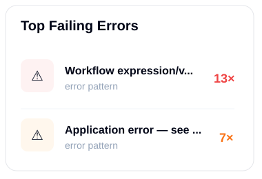

This card groups similar error messages together.

| Field | Meaning |
| --- | --- |
| Error pattern | Short version of the repeated error message. |
| Count | How many times that error happened. |

How to use it:

1. Look for the error pattern with the highest count.
2. Find a workflow row with the same error.
3. Click **Investigate**.
4. If the same pattern appears many times, it may be a common root cause.

### Screenshot: Daily Run Status

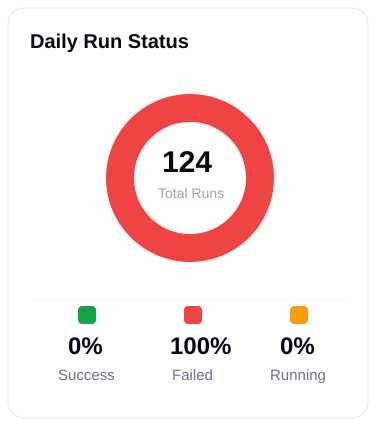

This chart shows workflow status for the selected day or date range.

| Field | Meaning |
| --- | --- |
| Total Runs | Total workflow runs counted. |
| Success % | Percentage of successful workflows. |
| Failed % | Percentage of failed workflows. |
| Running % | Percentage of workflows still running. |

In the screenshot, **100% Failed** means all workflows in that view failed.

How to check:

1. If **Failed %** is high, open the failed workflow table.
2. If **Running %** is high, check whether workflows are stuck.
3. If **Success %** is low, investigate the latest failed workflows.

### Screenshot: Weekly Run Status

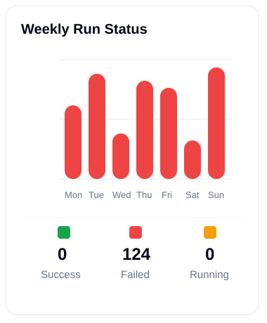

This chart shows workflow run status across the week.

| Chart Part | Meaning |
| --- | --- |
| X axis | Days of the week. |
| Y axis | Number of workflow runs. |
| Red bars | Failed workflow runs. |
| Green value | Successful workflow count. |
| Orange value | Running workflow count. |

How to check:

1. Find the day with the tallest red bar.
2. Check the failed workflow table for that day.
3. Search or filter by the process name that failed most often.
4. Click **Investigate** on one of the repeated failures.

### Workflow Table Fields

| Field | Meaning | How to Check |
| --- | --- | --- |
| No | Row number in the table. | Used only for easy reading. |
| Process Name | Name of the workflow process. | Search by process name if you know it. |
| Workflow ID | Unique ID for the workflow run. | Copy this ID when reporting or investigating. |
| Error Excerpt | Short error message for failed workflows. | Read this to understand the first clue. |
| Started At | Time when the workflow started. | Use this to match the failure time. |
| Status | Current workflow status. | Failed, Running, or Completed. |
| Env | Environment where the workflow ran. | Check if issue is only in one environment. |
| Action | Button to investigate the workflow. | Click **Investigate** for failed workflows. |

### Status Filters

| Filter | Shows |
| --- | --- |
| All | All workflows. |
| Failed | Only failed workflows. |
| Running | Workflows still running. |
| Completed | Successfully completed workflows. |

### How to Check a Failed Workflow

1. Open **Application Insights** for the app.
2. Click **Workflow Analysis**.
3. Select the correct **Date Range**.
4. Click the **Failed** filter.
5. Use search if you know the process name or workflow ID.
6. Read the **Error Excerpt**.
7. Click **Investigate**.

---

## 5. Investigate Workflow

### What This Is

The **Investigate** option opens more details for one workflow failure.

Use this when the error excerpt is not enough.

### Screenshot: Failed Workflow Details

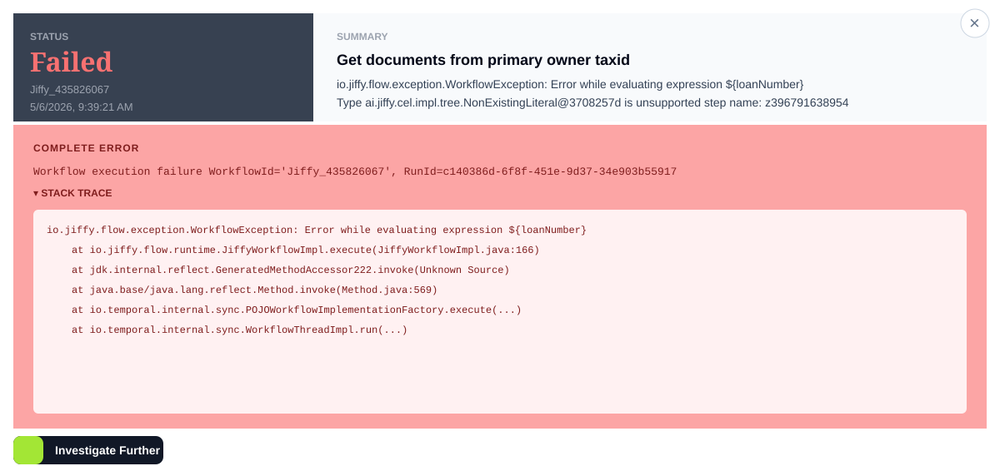

This is the first screen after opening a failed workflow.

| Area | Meaning | How to Check |
| --- | --- | --- |
| Status | Shows whether the workflow failed, completed, or is running. | If it shows **Failed**, continue investigation. |
| Workflow ID | Unique ID of the failed workflow. | Copy this when reporting the issue. |
| Time | When the workflow failed or started. | Match this time with charts and logs. |
| Summary | Process name and short failure message. | Read this to understand which process failed. |
| Complete Error | Full workflow failure message. | Use this as the main error text. |
| Stack Trace | Technical trace of where the workflow failed. | Useful for developers or support teams. |
| Investigate Further | Starts deeper analysis. | Click this to get RCA, suggested fix, and failure chain. |

In the screenshot, the workflow failed because the expression uses `${loanNumber}`, but that value was not available.

How to use this screen:

1. Copy the **Workflow ID**.
2. Read the **Summary**.
3. Read the first line of **Complete Error**.
4. Expand or review **Stack Trace** if needed.
5. Click **Investigate Further**.

### Screenshot: Detailed Analysis, RCA, And Suggested Fix

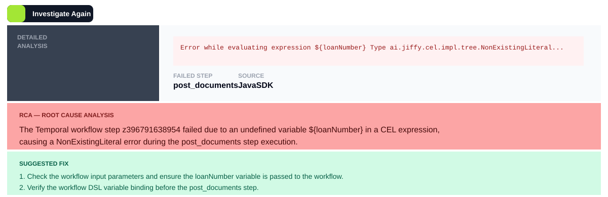

After investigation runs, the app shows the detailed analysis.

| Section | Meaning | How to Use |
| --- | --- | --- |
| Detailed Analysis | Shows the exact error, failed step, and source. | Use this to identify where the workflow failed. |
| Failed Step | Workflow step that failed. | Check this step in the workflow definition. |
| Source | System or service that reported the failure. | Use this to know where to look next. |
| RCA - Root Cause Analysis | Simple explanation of why the workflow failed. | Read this before checking logs. |
| Suggested Fix | Recommended actions to resolve the issue. | Follow these steps or share them with the responsible team. |

In the screenshot:

| Field | Value | Meaning |
| --- | --- | --- |
| Failed step | `post_documents` | The workflow failed during the post documents step. |
| Source | `JavaSDK` | The error came from the Java workflow execution layer. |
| Root cause | Missing `${loanNumber}` variable | The workflow tried to use a variable that was not present. |

How to check this screen:

1. Start with **Failed Step**.
2. Read the **RCA**.
3. Check if the variable, input, file, API, or service mentioned in the RCA exists.
4. Follow the **Suggested Fix**.
5. If you need proof, scroll to **Failure Chain** and evidence sections.

### Screenshot: Failure Chain

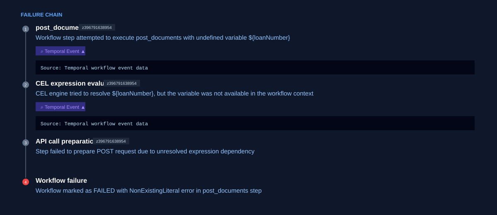

The **Failure Chain** explains the failure step by step.

| Part | Meaning |
| --- | --- |
| Step number | Order in which the failure happened. |
| Step name | Workflow step or action name. |
| Step ID | Internal workflow step ID. |
| Description | What happened in that step. |
| Temporal Event | Evidence from workflow event data. |
| Source panel | Shows where the evidence came from. |

How to use the failure chain:

1. Read from step 1 to the last step.
2. Find the first step where the real problem started.
3. Open the evidence panel if available.
4. Use the last step to confirm why the workflow was marked as failed.

In the screenshot, the chain shows:

1. `post_documents` tried to run with `${loanNumber}`.
2. CEL expression evaluation could not find `${loanNumber}`.
3. API call preparation failed.
4. The workflow was marked as failed.

### Screenshot: API Paths And Temporal Events

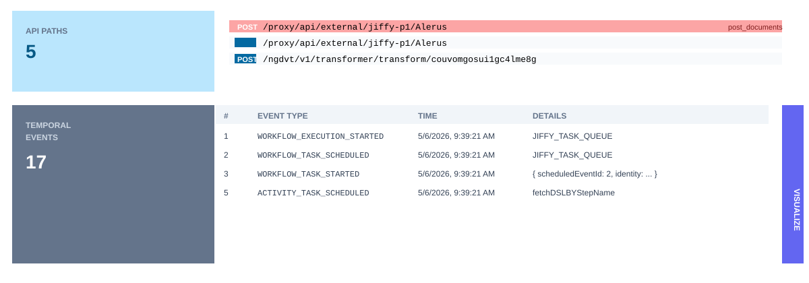

This section shows API calls and Temporal workflow events related to the failure.

| Area | Meaning | How to Check |
| --- | --- | --- |
| API Paths | API endpoints used by the workflow. | Check which API path failed or repeated. |
| Method | HTTP method such as POST or GET. | Failed POST calls often mean submit/update actions failed. |
| Step label | Workflow step connected to the API path. | Match this with the failed step. |
| Temporal Events | Internal workflow event history. | Use this to see the exact workflow sequence. |
| Event Type | Type of workflow event. | Check where the workflow moved from scheduled to started to failed. |
| Time | Event time. | Match this with charts and logs. |
| Details | Extra event details. | Useful for debugging. |
| Visualize | Opens the workflow flow view. | Use this to see the workflow path visually. |

How to check API and event data:

1. Look for highlighted API paths first.
2. Match the API path with the failed workflow step.
3. Check the Temporal event time.
4. Click **Visualize** if you want to see the workflow flow.

### Screenshot: Submit Fix

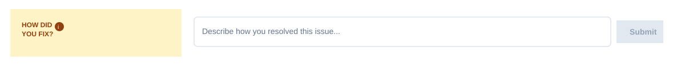

Use **How did you fix?** after the issue is resolved.

| Field | Meaning |
| --- | --- |
| Text box | Write what you changed to fix the issue. |
| Submit | Saves the fix for future similar errors. |

Good fix example:

`Passed loanNumber in workflow input before post_documents step and added validation for missing loanNumber.`

Avoid vague fixes like:

`Restarted service.`

How to submit a fix:

1. Resolve the issue.
2. Write the exact action taken.
3. Include the missing value, service name, config name, API path, or step name if known.
4. Click **Submit**.

### Screenshot: Workflow Flow Visualizer

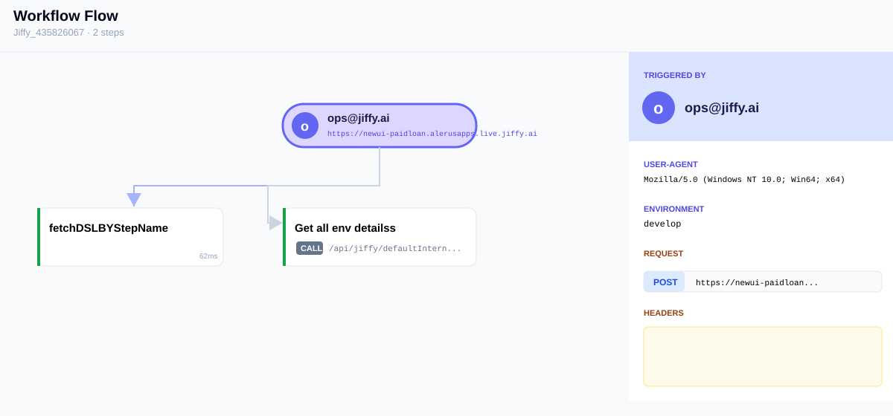

The workflow flow visualizer shows how the workflow moved between steps.

| Area | Meaning | How to Check |
| --- | --- | --- |
| Workflow Flow title | Workflow ID and number of steps. | Confirm you are viewing the correct workflow. |
| Triggered by | User or system that started the workflow. | Check who initiated the run. |
| Step boxes | Workflow steps that ran. | Follow the arrows from start to end. |
| Duration | Time taken by each step. | Long duration may indicate slowness. |
| Right panel | Request context, user agent, origin, environment, and request details. | Use this to understand how the workflow was triggered. |

How to use the flow:

1. Start at the top trigger node.
2. Follow the arrows between workflow steps.
3. Check which step failed or took longer.
4. Open the right panel details to see request information.

### Screenshot: Request Details

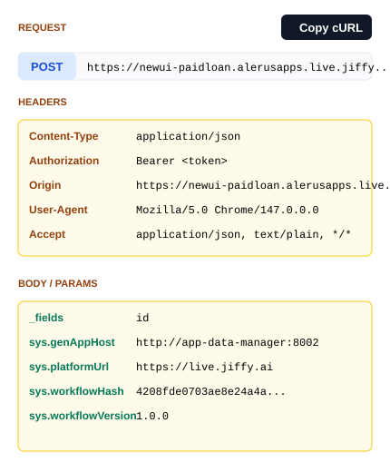

The request details panel shows the HTTP request that triggered or supported the workflow step.

| Field | Meaning |
| --- | --- |
| Method | HTTP method, such as POST. |
| URL | API endpoint called. |
| Copy cURL | Copies the request as a cURL command. |
| Headers | Request metadata, such as content type, origin, user agent, and authorization. |
| Body / Params | Input values sent with the request. |

How to check request details:

1. Confirm the **Method** and **URL**.
2. Check **Body / Params** for missing or wrong values.
3. Check **Headers** if the issue may be related to authorization, origin, or content type.
4. Use **Copy cURL** only when a developer needs to reproduce the request.

### What You Can See

| Section | Meaning |
| --- | --- |
| Status | Shows whether the workflow failed, completed, or is running. |
| Workflow ID | Unique ID of the workflow. |
| Started At | Time the workflow started. |
| Process Name | Workflow process name. |
| Complete Error | Full error message and stack trace if available. |
| Root Cause Analysis | Simple explanation of why the workflow failed. |
| Suggested Fix | Recommended steps to fix the issue. |
| Failure Chain | Step-by-step path that led to the failure. |
| Evidence Logs | Logs related to the failed workflow. |
| Previously Applied Fixes | Past fixes for similar errors, if available. |

### How to Use Investigation Details

1. Read the **Complete Error** first.
2. Read the **Root Cause Analysis**.
3. Check the **Failure Chain** to understand where it failed.
4. Open evidence logs if you need proof from logs.
5. Follow the **Suggested Fix**.
6. If you fixed the issue, submit the fix so others can reuse it later.

---

## 6. Quick Checks

### If A Tenant Looks Critical

1. Open **Dashboard**.
2. Select the correct date range and environment.
3. Click the tenant.
4. Check which app has high errors.
5. Open that app's **Application Insights**.

### If An App Has Errors

1. Open **Application Insights**.
2. Check **Total Errors** and **Error Rate**.
3. Check the error chart to see when errors started.
4. Open **Workflow Analysis** if workflow failures exist.

### If Users Report Slowness

1. Open the app in **Application Insights**.
2. Check **Average Latency** and **P95 Latency**.
3. Check the latency chart.
4. Change the date range to find when slowness started.

### If A Workflow Failed

1. Open **Workflow Analysis**.
2. Filter by **Failed**.
3. Search by workflow ID or process name.
4. Click **Investigate**.
5. Read root cause, logs, and suggested fix.

---

## 7. Simple Status Meaning

| Status / Color | Meaning |
| --- | --- |
| Green / Healthy | Working normally. |
| Yellow / Warning | Some issues are present. Check errors and latency. |
| Red / Critical | Many failures or poor health. Investigate quickly. |
| Failed | Workflow did not complete successfully. |
| Running | Workflow is still in progress. |
| Completed | Workflow finished successfully. |

---

## 8. Basic Troubleshooting

| Problem | What To Do |
| --- | --- |
| Dashboard data looks old | Check **Last Updated** and refresh the page. |
| Error rate is high | Open the app and check Application Insights. |
| Workflow failures are high | Open Workflow Analysis and filter by Failed. |
| App looks slow | Check Average Latency and P95 Latency. |
| Cannot find a workflow | Increase the date range or search by Workflow ID. |
| Investigation has no result | The workflow details may not be available anymore. Use error message and logs if shown. |

---

## 9. Best Way To Use The App

For most checks, follow this order:

1. Start from **Dashboard**.
2. Find the tenant or app with high errors.
3. Open **Application Insights**.
4. Check errors, error rate, health, and latency.
5. Open **Workflow Analysis** for failed workflows.
6. Click **Investigate** to understand the failure.
